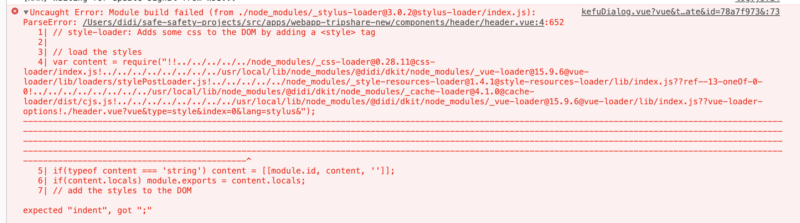

# 踩坑日志

## webpack-loader踩坑

### 现象
先看一张图

stylus-loader在处理一段style-loader执行后的内容

### 分析问题
首先了解一下关于stylus在wepback配置逻辑
```js
...
// 常规的webpack optional配置
{
  module: {
    rules: [
      {
        test: /\.styl(us)?$/,
        use: ['vue-style-loader', 'css-loader', 'stylus-loader']
      }
    ]
  }
}
...

// 我们的工程对外暴露的是webpack chain，我的本地配置如下
chainWebpack: config => {
  config.module
    .rule('stylus')
    .test(/\.styl(us)?$/)
    .use('vue-style-loader')
      .loader('vue-style-loader')
      .end()
    .use('css-loader')
      .loader('css-loader')
      .end()
    .use('stylus-loader')
      .loader('stylus-loader')
      .end()
}
```
看起来配置没问题，继续分析loader的逻辑: stylus-loader -> css-loader -> vue-style-loader(style-loader)；关于这部分的详细逻辑如下：

#### stylus-loader
- 解析配置
- 实例化stylus对象
- 配置能力挂载到stylus实例上
- 进行一些import和依赖处理，初始化环境
- styl.render(fn) （以下的流程走向了核心stylus）
- render对象的parse方法
- 核心parse方法
```
- parse
- evaluate
- normalize
- compile
```
是从stylus->css的过程

#### css-loader
处理css中的import和url资源，将css资源包装成模块，方便后续的style-loader调用更新
```js
// Imports
var ___CSS_LOADER_API_IMPORT___ = require("../node_modules/css-loader/dist/runtime/api.js");
var ___CSS_LOADER_EXPORT___ = ___CSS_LOADER_API_IMPORT___(function(i){return i[1]});
// Module
___CSS_LOADER_EXPORT___.push([module.id, "\n.app[data-v-5ef48958] {\n    color: red;\n}\n", ""]);
// Exports
module.exports = ___CSS_LOADER_EXPORT___;
```

#### style-loader vs vue-style-loader
本质是将css通过style标签插入到文档流里
```js
// style-loader: Adds some css to the DOM by adding a <style> tag

// load the styles
var content = require("!!../node_modules/css-loader/dist/cjs.js??ref--1-1!../node_modules/vue-loader/lib/loaders/stylePostLoader.js!../node_modules/vue-loader/lib/index.js??vue-loader-options!./app.vue?vue&type=style&index=0&id=5ef48958&scoped=true&lang=css&");
if(typeof content === 'string') content = [[module.id, content, '']];
if(content.locals) module.exports = content.locals;
// add the styles to the DOM
var add = require("!../node_modules/vue-style-loader/lib/addStylesClient.js").default
var update = add("d929f8d0", content, false, {});
// Hot Module Replacement
if(module.hot) {
 // When the styles change, update the <style> tags
 if(!content.locals) {
   module.hot.accept("!!../node_modules/css-loader/dist/cjs.js??ref--1-1!../node_modules/vue-loader/lib/loaders/stylePostLoader.js!../node_modules/vue-loader/lib/index.js??vue-loader-options!./app.vue?vue&type=style&index=0&id=5ef48958&scoped=true&lang=css&", function() {
     var newContent = require("!!../node_modules/css-loader/dist/cjs.js??ref--1-1!../node_modules/vue-loader/lib/loaders/stylePostLoader.js!../node_modules/vue-loader/lib/index.js??vue-loader-options!./app.vue?vue&type=style&index=0&id=5ef48958&scoped=true&lang=css&");
     if(typeof newContent === 'string') newContent = [[module.id, newContent, '']];
     update(newContent);
   });
 }
 // When the module is disposed, remove the <style> tags
 module.hot.dispose(function() { update(); });
}
```

vue-style-loader folk自style-loader，保留了基本功能，例如详细的options没有继承，但是新增了ssr的style能力。所以需要`ssr`项目使用vue-style-loader，而其他项目保留style-loader，保留其配置的丰富性。

到这里应该很好理解为什么说报错里的内容是style-loader的结果，而为何再此被stylus-loader调用执行呢？这就要说到webpack-chain的机制了，也确实是我配置上踩了坑。

#### webpack-chain
chainMap & chainSet，提供了一种链式调用的机制，并且会返回当前执行的结果给下一个use方法去执行，因此存在多次定义多次执行的可能

进而也就解释了为什么会在style-loader执行完以后还有stylus-loader执行其内容。此时，只需要将这个冗余的配置删除即可。

到这里我们的问题定位基本完成了，那么讲一些cube-ui的一些配置问题，这里提到了后编译概念，这里的原理和配置思路同步一下，方便大家参考同时掌握。

### 后编译的思路
cube-ui的后编译概念，npm包随应用编译打包一块编译
es6代码直接被应用项目调用，减少无用的编译代码
- webpack-transform-modules-plugin
```json
{
  // 后编译配置
  "transformModules": {
    "cube-ui": {
      "transform": "cube-ui/src/modules/${member}",
      "kebabCase": true
    }
  },
  // 普通编译配置
  "transformModules": {
    "cube-ui": {
      "transform": "cube-ui/lib/${member}",
      "kebabCase": true,
      "style": {
        "ignore": ["create-api", "better-scroll", "locale"]
      }
    }
  }
}
```
- webpack-post-compile-plugin  后编译情况下子包的依赖分析
  - 应用中package.json添加compileDependencies: ["A", "B"]指定后编译的包
- babel-plugin-transform-modules  按需引入的处理
  - preventFullImport: true in .babelrc with normal import style

## vue-loader在干什么，很有意思
怎么分析模板、script和css，以及如何引用
